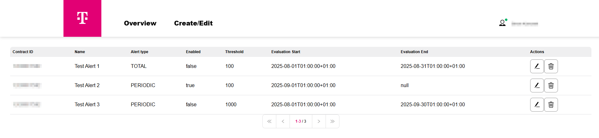

User interface
==============

Alert service provides a lightweight UI to check existing alerts and create new alerts.

After accessing the service, you will see the Landing page. It lists all alerts created
against the contract/account. User can edit or delete alerts from this page by clicking
the icons in the column "Actions".

Alert types
-----------

There are currently two kinds of alerts supported in Alert Service.
Periodic Alerts and Cumulative Alerts. Periodic alerts evaluate consumption within
recurring intervals (daily or monthly). Cumulative alerts track consumption from a
specific evaluation date onward until a set threshold is reached. 

Attributes for cumulative alerts

+---------------------------+----------------------+----------------------+
| Input                     | Mandatory            | Description          |
+===========================+======================+======================+
| Alert type                | Yes                  | Switch between       |
|                           |                      | different alert      |
|                           |                      | types                |
+---------------------------+----------------------+----------------------+
| Alert contract            | Yes                  | Contract used for    |
|                           |                      | evaluation of alert  |
+---------------------------+----------------------+----------------------+
| Alert name                | Yes                  | Name of the alert    |
+---------------------------+----------------------+----------------------+
| Start date                | No                   | Start date since     |
|                           |                      | the alert is being   |
|                           |                      | checked/evaluated    |
+---------------------------+----------------------+----------------------+
| End date                  | No                   | End date until the   |
|                           |                      | alert is being       |
|                           |                      | checked              |
+---------------------------+----------------------+----------------------+
| Evaluation Date           | Yes                  | Date since the       |
|                           |                      | consumption is       |
|                           |                      | accumulated for the  |
|                           |                      | alert                |
+---------------------------+----------------------+----------------------+
| Ratio threshold           | No                   | Default set to 0.8   |
|                           |                      | When the alert       |
|                           |                      | reaches 80% of the   |
|                           |                      | alert threshold, a   |
|                           |                      | warning is sent      |
+---------------------------+----------------------+----------------------+
| Alert threshold           | No                   | Consumption value    |
|                           |                      | to be reached to     |
|                           |                      | trigger an alarm     |
+---------------------------+----------------------+----------------------+
| Enabled                   | No                   | Default enabled.     |
|                           |                      | Used to turn off/on  |
|                           |                      | the alert            |
+---------------------------+----------------------+----------------------+

Attributes for periodic alerts

+---------------------------+----------------------+----------------------+
| Input                     | Mandatory            | Description          |
+===========================+======================+======================+
| Alert type                | Yes                  | Switch between       |
|                           |                      | different alert      |
|                           |                      | types                |
+---------------------------+----------------------+----------------------+
| Alert contract            | Yes                  | Contract used for    |
|                           |                      | evaluation of alert  |
+---------------------------+----------------------+----------------------+
| Alert period              | Yes                  | Interval used for    |
|                           |                      | alert evaluation     |
+---------------------------+----------------------+----------------------+
| Alert name                | Yes                  | Name of the alert    |
+---------------------------+----------------------+----------------------+
| Start date                | No                   | Start date since     |
|                           |                      | the alert is being   |
|                           |                      | checked/evaluated    |
+---------------------------+----------------------+----------------------+
| End date                  | No                   | End date until the   |
|                           |                      | alert is being       |
|                           |                      | checked              |
+---------------------------+----------------------+----------------------+
| Ratio threshold           | No                   | Default set to 0.8   |
|                           |                      | When the alert       |
|                           |                      | reaches 80% of the   |
|                           |                      | alert threshold, a   |
|                           |                      | warning is sent      |
+---------------------------+----------------------+----------------------+
| Alert threshold           | No                   | Consumption value    |
|                           |                      | to be reached to     |
|                           |                      | trigger an alarm     |
+---------------------------+----------------------+----------------------+
| Enabled                   | No                   | Default enabled.     |
|                           |                      | Used to turn off/on  |
|                           |                      | the alert            |
+---------------------------+----------------------+----------------------+

