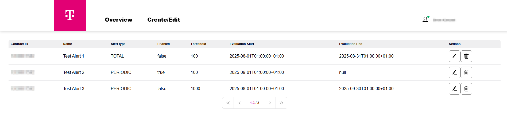

User interface
==============

Alert service provides a lightweight UI to check existing alerts and create new alerts.

After accessing the service, you will see the Landing page. It lists all alerts created
against the contract/account. User can edit or delete alerts from this page by clicking
the icons in the column "Actions".

Alert types
-----------

There are currently two kinds of alerts supported in Alert Service.
Periodic Alerts and Total Alerts. Periodic alerts evaluate consumption within
recurring intervals (daily or monthly). Total alerts track consumption from a
specific evaluation date onward until a set threshold is reached.

Attributes for Total alerts

+---------------------------+----------------------+------------------------------+
| Input                     | Mandatory            | Description                  |
+===========================+======================+==============================+
| Type                      | Yes                  | Switch between               |
|                           |                      | different alert              |
|                           |                      | types                        |
+---------------------------+----------------------+------------------------------+
| Contract                  | Yes                  | Contract used for            |
|                           |                      | evaluation of alert          |
+---------------------------+----------------------+------------------------------+
| Name                      | Yes                  | Name of the alert            |
+---------------------------+----------------------+------------------------------+
| Active from               | No                   | Start date since             |
|                           |                      | the alert is being           |
|                           |                      | checked/evaluated            |
+---------------------------+----------------------+------------------------------+
| Active until              | No                   | End date until the           |
|                           |                      | alert is being checked       |
+---------------------------+----------------------+------------------------------+
| Accumulate from           | Yes                  | Date since the               |
|                           |                      | consumption is               |
|                           |                      | accumulated for the          |
|                           |                      | alert                        |
+---------------------------+----------------------+------------------------------+
| Warn upon reaching        | No                   | Default set to 0.8           |
| limit fraction            |                      | When the alert               |
|                           |                      | reaches 80% of the           |
|                           |                      | alert threshold, a           |
|                           |                      | warning is sent              |
+---------------------------+----------------------+------------------------------+
| Amount limit              | Yes                  | Consumption value            |
|                           |                      | to be reached to             |
|                           |                      | trigger an alarm             |
+---------------------------+----------------------+------------------------------+
| Enabled                   | No                   | Default enabled.             |
|                           |                      | Used to turn off/on          |
|                           |                      | the alert                    |
+---------------------------+----------------------+------------------------------+

Attributes for periodic alerts

+---------------------------+----------------------+------------------------------+
| Input                     | Mandatory            | Description                  |
+===========================+======================+==============================+
| Type                      | Yes                  | Switch between               |
|                           |                      | different alert types        |
+---------------------------+----------------------+------------------------------+
| Contract                  | Yes                  | Contract used for            |
|                           |                      | evaluation of alert          |
+---------------------------+----------------------+------------------------------+
| Interval                  | Yes                  | Periodic interval to be      |
|                           |                      | used for evaluation of alert |
+---------------------------+----------------------+------------------------------+
| Name                      | Yes                  | Name of the alert            |
+---------------------------+----------------------+------------------------------+
| Active from               | No                   | Start date since             |
|                           |                      | the alert is being           |
|                           |                      | checked/evaluated            |
+---------------------------+----------------------+------------------------------+
| Active until              | No                   | End date until the           |
|                           |                      | alert is being checked       |
+---------------------------+----------------------+------------------------------+
| Warn upon reaching        | No                   | Default set to 0.8           |
| limit fraction            |                      | When the alert               |
|                           |                      | reaches 80% of the           |
|                           |                      | alert threshold, a           |
|                           |                      | warning is sent              |
+---------------------------+----------------------+------------------------------+
| Amount limit              | Yes                  | Consumption value            |
|                           |                      | to be reached to             |
|                           |                      | trigger an alarm             |
+---------------------------+----------------------+------------------------------+
| Enabled                   | No                   | Default On.                  |
|                           |                      | Used to turn off/on          |
|                           |                      | the alert                    |
+---------------------------+----------------------+------------------------------+

Common attributes for both alerts

Advanced Options:

+---------------------------+----------------------+---------------------------------------+
| Input                     | Mandatory            | Description                           |
+===========================+======================+=======================================+
| Project                   | No                   | Select projects applicable for alert  |
+---------------------------+----------------------+---------------------------------------+
| Product                   | No                   | Select products applicable for alert  |
+---------------------------+----------------------+---------------------------------------+
| Region                    | No                   | Select regions applicable for alert   |
+---------------------------+----------------------+---------------------------------------+
