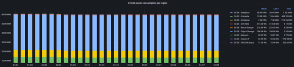
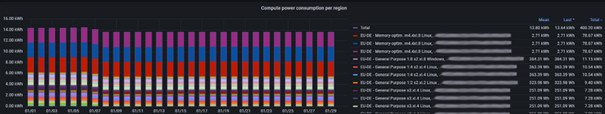
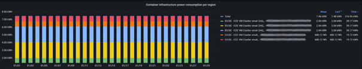
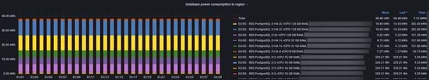
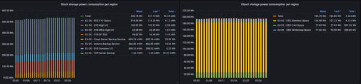
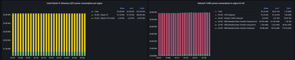

Sustainability Dashboard User Manual
====================================

Overview
--------

The Sustainability Dashboard for presents detailed, service-level transparency on the estimated power
usage and related greenhouse gas emissions for customer workloads. It supports both EU-DE and EU-NL
regions, and organizes the collected data into two main areas:
    - Power Consumption Reporting
    - Emissions Reporting

Each reporting area further breaks down by service type (Compute, Database, Storage, Network), first
providing high-level totals, then detailed, resource-level breakdowns.

Dashboard Structure & Section Explanations
------------------------------------------

Design of the Dashboard
-----------------------

The dashboard is organized into two main sections:
    - Upper section: Daily Power Consumption
    - Lower section: Daily CO₂-equivalent (CO₂eq) Emissions

Both sections follow the same structure.
At the top of each section, a summary panel presents the overall aggregated value for the selected period.
Below the summary, detailed graphs break down the total into the main technology domains:
    - Compute
    - Container Infrastructure
    - Database Services
    - Block Storage
    - Object Storage
    - Used Elastic IP Addresses
    - Network Traffic

This structure enables to visualize immediately the total environmental impact and then analyze how
different technologies contribute to it.

Each panel displays the data with three legend indicators:
    - Mean 
      The average value over the selected period.
      For power, this represents the average power demand during that interval.
      For emissions, it reflects the average emission rate over time.
    - Last
      The most recent recorded value within the selected time range.
      This helps identify the current state or latest measured level.
    - Total
      The cumulative value over the selected period.
      For power, this represents total energy consumed (e.g., Wh or kWh).
      For emissions, it represents total CO₂-equivalent emissions generated during that interval.

Note: “Mean” helps understand steady-state behavior, “Last” reflects the current situation, and “Total”
supports reporting and accounting purposes.
Time range: On the upper right side of the dashboard, the required absolute time range can be inserted:
Please insert the “From” and “To”-date and press the button “Apply Time Range”.
Attention: Please be aware that the units are not harmonized: You will find kWh next to Wh.  For further
data processing please ensure, that all data is using the same units.

1. Overall Figures by Technology
--------------------------------

If applicable, data for EU-DE and EU-NL are shown in the same graphs. It is not possible to select only one
region.

Overall panels:
    - The overall panels provide a general view of the aggregated power consumption and emissions per
      region and reporting period (either daily, weekly, monthly, year to year or custom granularity).
    - Visualize total power or emissions, broken down by service type (e.g.: Compute, Database, Storage, Network).
    - Understand immediately which services contribute most to your environmental footprint.

2. Compute Service Details
--------------------------

    - Each VM’s power consumption shown based on average measured power consumption per resource type,
      not real time measurements.
    - VM ID and type included, even for short-lived resources.
    - Enables to compare individual VM configurations, optimize workload placement, and identify
      high-impact resources.

3. Containers Infrastructure Details
------------------------------------

    - Each container power consumption shown based on average measured power consumption per resource type,
      not real time measurements.
    - Container ID and type included, even for short-lived resources.
    - Enables to compare individual container cluster, optimize workload placement, and identify
      high-impact resources.

4.	Database Service Details
----------------------------

    - Detailed view of databases, with resource ID and type.
    - Allocation based on compute/memory used.
    - Make informed decisions about database sizing and technology choice.

5.	Storage Service Details
---------------------------

    - Power consumption and emissions generated per allocated GB per time of use.
    - Allows to compare the power draw differences from storage allocations based on technology
      type.

6.	Network Service Details
---------------------------

    - Power consumption and derived emissions based on total elastic IP services and aggregated
      network traffic.
    - Provides visibility of network usage’s role in overall power/emissions.

7.	Derived Emissions Sections
------------------------------
    
    - Follows the same breakdown as power consumption, calculating emissions using region-specific
      factors and GHG Protocol methodology.
    - Automatically scales units (µg/mg/g/kg CO₂e) for clear interpretation.
    - Compare emissions per service or workload, informing architectural decisions.

8.	Temporal Analysis
---------------------

    - All data presented in daily bins enables time-based trend analysis.
    - Supports optimization by tracking sustainability improvements or regressions over time.

How to Use the Dashboard
========================

Step-by-Step Guidance
---------------------

    1.	Select Time Window. On the upper right side of the panel.

        .. image:: media/image07.png

    2.	Review Overall KPIs for a summary view.
    3.	Analyze totals by technology to spot high-impact areas.
    4.	Drill down into Compute, Containers, Database, Storage, and Network details
        Use per-resource breakdowns to identify inefficient usages.
        Compare across resources and services.
    5.	Switch to Derived Emissions for carbon impact insight.
    6.	Utilize the time-based, daily aggregation to track changes and improvements.
    7.	Apply findings to optimize workload architecture and improve sustainability.
    8.	Export or snapshot data for integration with internal reporting frameworks using the data explore
        option.

        .. image:: media/image08.png

    9.	In case of the “Overall” power or emissions panel, chose “Series joined by time” to export all
        the infrastructure categories totals, or the values per components individually.

        .. image:: media/image09.png

        .. image:: media/image10.png

Key Capabilities
----------------

    - Options to filter /service/time.
    - Options to visualize and export data in high level detail or detailed per category.
    - Export/download features for compliance or further analysis.
    - Aggregated and granular resource-level metrics.

Considerations
--------------

    - All figures are estimates, suitable for indicative/relative analysis,  for billing or utilized resources
      details, please head to the corresponding sections in the financial dashboard or T Cloud Public Console
      accordingly.
    - Pay close attention to the units when exporting the data, some local configurations may affect how the
      data is exported for further use and data conversion may result in incorrect reporting.
    - At launch, not all cloud services may be covered initially; new coverage added incrementally.

FAQ
===

1.	What is the  T Cloud Public sustainability dashboard?
---------------------------------------------------------

The sustainability dashboard provides visibility into the power consumption and associated emissions
attributed to each tenant’s cloud usage. It complements the financial dashboard by adding
sustainability as an additional dimension, alongside cost and performance, to support environmental
disclosure reporting and more informed technical and architectural decisions.

2.	What level of detail does the dashboard provide?
----------------------------------------------------

The dashboard allocates power consumption and emissions to individual cloud services, such as virtual
machines, databases, storage, and data traffic. This service-level view enables customers to better understand
how different architectural choices influence energy use and environmental impact. For example, by evaluating
the power consumption of the same workload in different virtual machines, and make an informed decision not
only based on performance, but power consumption and environmental impact.

3.	How are power consumption values calculated?
------------------------------------------------

Power consumption is estimated using an architecture-based allocation approach that reflects how shared cloud
infrastructure actually consumes energy.
At a high level, the calculation starts from the measured power consumption of physical infrastructure (such as
compute and storage servers). This total power is then distributed proportionally across the cloud services
running on that infrastructure, based on their actual use of resources. Data center overheads (such as cooling)
are included using the site’s Power Usage Effectiveness (PUE).
In simplified terms, the approach can be described as: Physical host power × service’s share of resources × PUE
This approach is meant to attribute only the portion of power each service is responsible for, rather than 
the full power draw of the underlying hardware. 

4.	How does this work in practice for virtual machines and storage?
--------------------------------------------------------------------

For virtual machines, power consumption is broken down into components that reflect how VMs use shared servers:

    - CPU-related power, based on the number of vCPUs used
    - Memory-related power, based on allocated memory
    - A proportional share of the server’s baseline (such as fans, power supplies, network interfaces) power,
      allocated according to the VM’s share of total resources

This accounts for both active usage of compute resources and the unavoidable physical host overhead to be allocated
fairly across tenants.

For storage services, a similar principle is applied. Power consumption is estimated based on:
    - The total power draw of the storage systems
    - The number and type of storage nodes serving the capacity
    - The logical storage capacity allocated to customers

Storage usage is calculated at a GB-day resolution and further broken down into GB-hours, including short-lived
allocations and changes over time are reflected. From this, an average energy-per-GB-hour value is derived for
each storage technology (for example block or object storage, SSD- or SAS-based), which is then applied to
the customer’s actual usage.

5.	How are emissions derived from power consumption?
-----------------------------------------------------

Once power consumption has been estimated for a given service and usage unit (for example VM-hours or GB-hours),
emissions are calculated by multiplying this energy consumption by a region-specific emissions factor.
These factors reflect the carbon intensity associated with the data center location and are applied in line with
the GHG Protocol market-based approach for Scope 1 and Scope 2 reporting.

6.	Which emissions scopes are included?
----------------------------------------

The dashboard reports emissions according to the GHG Protocol market-based approach for Scope 1 and Scope 2,
fully aligned with Deutsche Telekom Group’s corporate sustainability reporting.
    - Scope 1 is driven by the emissions from the data center backup diesel generators, used exclusively
      for testing and emergency preparedness. These represent an almost negligible share of total emissions
      but are included for transparency.
    - Scope 2 reflects T-Systems 100% clean energy procurement agreements.
    - Scope 3 from embedded emissions from infrastructure, are not included at this stage.

7.	Are Scope 3 upstream/downstream embedded emissions planned to be included?
------------------------------------------------------------------------------

Yes. The inclusion of Scope 3 embedded emissions is part of the roadmap. When introduced, they will follow
including ISO 14067 for product carbon footprinting. Until then, the dashboard remains intentionally limited
to Scope 1 and Scope 2 to ensure methodological consistency and transparency.

8.	Why do the figures differ from previous sustainability reports?
-------------------------------------------------------------------

The main difference is driven by an improvement on methodology. Earlier reports relied on more conservative
allocation approaches, to address limited technical visibility available at the time. The current methodology
improves accuracy by using usage-based attribution, assigning only the portion of power and emissions directly
driven by a tenant’s workloads. As a result, figures may differ from earlier reports at tenant or service level.
This change reflects an improvement in precision rather than a change in reporting scope.

9.	Does the dashboard include idle or unused infrastructure capacity?
----------------------------------------------------------------------

No. Shared idle capacity and unallocated platform overhead are not attributed to customers, as they remain the
responsibility of the cloud provider. The dashboard intentionally focuses on customer-driven consumption to ensure
fair and meaningful attribution.

10.	Does the dashboard show the total power consumption of T Cloud Public?
--------------------------------------------------------------------------

No. The dashboard shows only tenant-attributed power consumption and emissions, not the total power consumption of
our data centers or the overall platform. We want to enable users to see the environmental impact associated with
their own usage, not our complete environmental footprint, for that we have our recognized and awarded
Corporate Responsibility report (https://www.cr-report.telekom.com/).

11.	Will all cloud services be available from the start?
--------------------------------------------------------

The dashboard capabilities are introduced incrementally. Not all services are visible from day one, and additional
services and levels of detail will be added over time. We strive for a continuous improvement approach rather than
a static reporting snapshot.

12.	How can customers use this information in practice?
-------------------------------------------------------

The dashboard is designed to support:
    - Sustainability and regulatory reporting
    - Internal transparency and governance
    - Architectural comparisons between services
    - More energy/emissions-aware workload design decisions
By presenting sustainability data with the same granularity as cost and performance, it enables sustainability to become
a practical design consideration rather than a retrospective reporting exercise.

13.	Is this dashboard intended to replace T-Systems’ corporate sustainability reports?
--------------------------------------------------------------------------------------

No. The dashboard complements, but does not replace, corporate-level sustainability reporting. It provides operational,
usage-based insights that customers can use alongside their existing reporting processes.

14.	How will the dashboard evolve over time?
--------------------------------------------

The dashboard will continue to evolve as:
•	Additional services are onboarded
•	Methodologies are refined
•	Hardware infrastructure changes
•	Reporting strategy evolves
•	New regulatory and sustainability requirements emerge
This evolution reflects our ongoing commitment to transparency, responsibility, and sustainable cloud engineering.

15.	What is the granularity of the reported data?
-------------------------------------------------

Data is collected hourly and aggregated with daily granularity, allowing to observe trends and consumption patterns
hour-by-hour for storage and in 24-hour blocks for other services.

16.	How does the dashboard support sustainability reporting requirements?
-------------------------------------------------------------------------

By providing standardized, GHG Protocol-aligned figures broken down by region and resource, the dashboard supports
both internal transparency and external reporting for regulations or voluntary disclosures.

17.	Can I compare sustainability performance between different architectural choices or services?
-------------------------------------------------------------------------------------------------

Yes, the dashboard’s per-service and per-resource breakdown enables direct comparison. You can evaluate which VM,
storage type, or network configuration is optimal from an environmental perspective.

18.	How are shared infrastructure and platform-wide overheads treated?
----------------------------------------------------------------------

Shared Data Center scale components (e.g. cooling, lighting and other non-IT components) are allocated proportionally
using annual average PUE factors. Only the customer-attributed share is included; idle platform capacity remains with the provider.

19.	Are there audit trails or methodologies documented for transparency?
------------------------------------------------------------------------

Yes, all models, assumptions, and boundaries are documented in detail, the general approach is available in the “About” section
from the dashboard and further detail available upon request. 

20.	What’s the minimum reporting unit for short-lived resources?
----------------------------------------------------------------

Even resources used for just one hour are reported with their full environmental impact for that period.

21.	What happens if my service is not listed on the dashboard?
--------------------------------------------------------------

The dashboard is expanding incrementally. Contact your Open Telekom Cloud representative for updates or custom reporting needs.

22.	Is third-party validation or certification applied to these metrics?
------------------------------------------------------------------------

Metrics follow documented methodologies aligned to industry standards. Certification processes are under consideration as part
of roadmap advances.

23.	How do PUE and renewable energy contracts affect my results?
----------------------------------------------------------------

Regional PUE factors are used to allocate non-IT overhead. Electricity emission factors reflect real-world PPAs and
GoOs, showing the tangible benefit of clean energy procurement. And this is why emissions count appears low.

24.	How can I take action based on dashboard insights?
------------------------------------------------------

    - Right-size workloads (reduce underutilized VMs)
    1.	Identify VMs with consistently high power consumption in the dashboard.
    2.	Cross-check CPU and memory utilization in your monitoring system.
    3.	If utilization remains low (e.g., <30%) over time while power remains constant, consider resizing
        to a smaller flavor.
    4.	After resizing, verify the reduction in the dashboard’s total energy and emissions.

Practical example:
A VM running at 15% average CPU utilization but consuming the same baseline power as a fully utilized instance may be
downsized to reduce footprint.
    - Move storage to more efficient types
    1.	Compare power-per-GB metrics across storage classes.
    2.	Identify volumes with low IOPS or infrequent access.
    3.	Migrate archival or infrequently accessed data to lower-intensity storage tiers.
    4.	Confirm reduction in total emissions in subsequent reporting periods.

Practical example:
Cold data stored on high-performance SSD-based storage may be moved to warm or cold tiers with significantly
lower power intensity per GB.
    - Reduce data transfers or optimize networking
    1.	Review network-related power and emissions.
    2.	Identify cross-region traffic or excessive replication.
    3.	Consolidate workloads within the same region where possible.
    4.	Reassess total emissions after optimization.

Practical example:
Frequent cross-region replication can significantly increase energy allocation from networking and storage infrastructure.
    - Use metrics for regulatory disclosures and sustainability targets
    1.	Export total emissions for the reporting period.
    2.	Allocate them internally to departments or cost centers.
    3.	Compare trends year-over-year.
    4.	Use reductions achieved through optimization as measurable progress indicators.

25.	How can I calculate location-based emissions instead of using the market-based approach?
--------------------------------------------------------------------------------------------

Our reporting follows the market-based methodology for Scope 2 emissions, in full alignment with applicable EU regulatory
standards, including the EU Sustainability Disclosure Regulation (SFDR), the EU Taxonomy, and the Energy Efficiency
Directive. Both market-based and location-based Scope 2 accounting methods are accepted, as long as methodologies
and boundaries are transparently documented.
If you prefer to assess Scope 2 emissions using a location-based method, simply multiply the electricity consumption
of your cloud resources in each region by the latest published country-specific grid emission factor (kg CO₂e/kWh)
for that location. For Germany (EU-DE) and the Netherlands (EU-NL), we recommend using the emission intensity values
reported by the European Environment Agency (EEA): https://www.eea.europa.eu/en/analysis/indicators/greenhouse-gas-emission-intensity-of-1
This approach ignores any T-Systems contractual clean electricity purchases and instead reflects the average emissions
of the public electricity grid in each country for the selected timeframe.

Example Calculation:
Location-based emissions = Reported electricity consumed (kWh) × National grid emission factor (kg CO₂e/kWh)
When performing this calculation, ensure that power consumption is normalized to kilowatt-hours (kWh) and apply the
EEA grid factor relevant to the reporting period you are analyzing.
Getting Support
    - For guidelines to export data from Grafana, please review the available documentation in
      https://docs.otc.t-systems.com/enterprise-dashboard/umn/ or contact our helpdesk.
    - For questions regarding sustainability reporting, improvement suggestions, use the feedback feature or contact our helpdesk.

