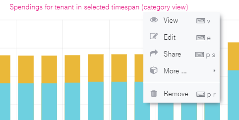

FAQ
===

Question: How can I change the displayed timespan in a dashboard?
-----------------------------------------------------------------

At the top right of each dashboard is a selector where you can
configure your displayed timespan. Just click the Clock Icon. See in
the screenshot below:

.. image:: ./media/image17.png
   :width: 6.28617in
   :height: 1.93213in

Question: How can I create my own dashboard and widgets?
--------------------------------------------------------

We recommend creating a new dashboard if you want to have additional
widgets. You can check the following documentation to get more
information on how to create new widgets.

Getting started: https://grafana.com/docs/guides/getting_started/

New Graphs in dashboards: https://grafana.com/docs/features/panels/graph/

New Tables in dashboards: https://grafana.com/docs/features/panels/table_panel/

Question: My widget is very crowded. How can I select a certain service?
------------------------------------------------------------------------

Each widget can be limited to show only one of the originally
displayed data sets by clicking the names right next to the graph. You
can de-select the data set by clicking it again.

.. image:: ./media/image18.png
   :width: 6.179in
   :height: 1.35878in

Question: Can I use the Dashboard when data is updated?
-------------------------------------------------------

Yes, the dashboard will be accessible and data available.

Question: How can I download data?
----------------------------------

If you are an Editor or Admin User, it’s possible to download data
from each widget by clicking on the name of the widget More Export
CSV. Additionally, data can be received via API, please check chapter
4 API

.. image:: ./media/image20.png
   :width: 5.03817in
   :height: 2.73569in

Question: Where do I reset my password?
---------------------------------------

Please use this link: https://enterprise-dashboard.otc-service.com/user/password/send-reset-email

Additionally, you can reset your password by following the “Forget
Password” link on the login page of Enterprise Dashboard.

Question: I can’t log in. What’s wrong?
---------------------------------------

You can use both E-Mail and Username to login, but be aware that both
the log-in and forget password fields are case-sensitive. This means
if your E-Mail address is for example configured as test@provider.com,
you also need to log in to test@provider.com. test@provider.com will
not be recognized. If you forgot your password, please use the link in
chapter 5.6. You can also change your E-Mail address to all minor case
within the preferences.

Question: I see users who are not added by me in the Grafana User management. Why?
----------------------------------------------------------------------------------

There are four default users which are used by operations or dashboard
squad itself to establish hotfixes or to help with customer issues.

-  Admin

-  Provisioning

-  Account for Payer Dashboard

-  Account for Tenant Dashboard

Question: I see “Average” and “Total” in almost every panel. How is this calculated?
------------------------------------------------------------------------------------

The average and total are calculated on the exact amount of datasets
in the selected timespan. More information here:
https://grafana.com/docs/features/panels/graph/

Question: I can see some products with a cost of 0€ and some with 0.00€. What's the difference?
-----------------------------------------------------------------------------------------------

Products that have been used but are still in the free budget will be
displayed as 0€. 0.00€ will be displayed if there are costs smaller
than 1 cent. Technically those are still costs that will be invoiced,
therefore they are displayed in Enterprise Dashboard. You can hide
these products by ticking “hide series” options in the legend options
of each panel. Please note that editing a dashboard or panel is only
available for Editor or Admin Users.

.. image:: ./media/image21.png
   :width: 5.85417in
   :height: 2.16752in

Question: How do you handle S/W time changeover?
------------------------------------------------

Within Enterprise Dashboard a changeover between summer and winter
time is visible on the specific dates by observing the quantity
field. For example, a machine that is never stopped will have a
runtime of 23 hours on March 28, 2021 and 25 hours on October
27, 2019.

Below you will find the runtime of a unique machine, which was running 24/7. You can clearly see the drop on a S/W time changeover.

.. image:: ./media/image22.png
   :width: 6.62222in
   :height: 1.95417in

.. image:: ./media/image23.png
   :width: 6.62222in
   :height: 1.94514in

Question: Which version of Enterprise Dashboard do I have?
----------------------------------------------------------

Enterprise Dashboard will be listed within your invoice, therefore you
can see Enterprise Dashboard within your consumption data. Enterprise
Dashboard is billed on the first day of a month.
