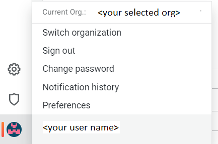
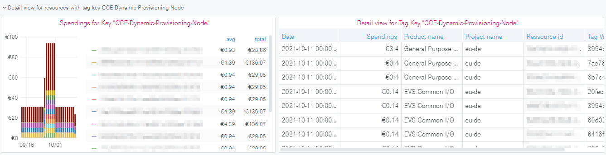
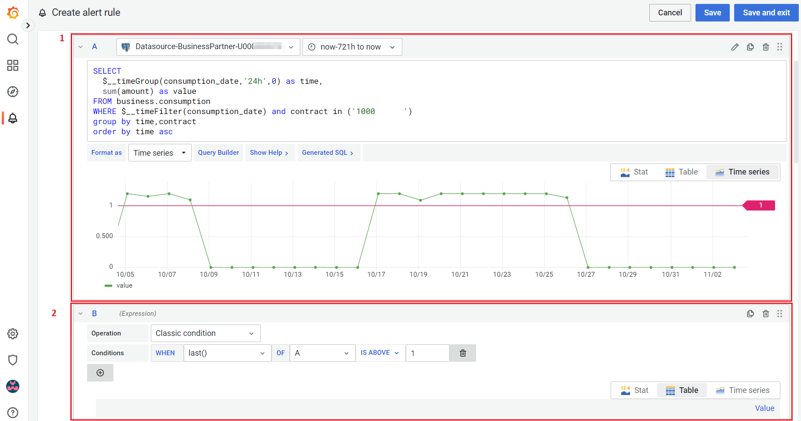

How to
======

Switch Organizations
--------------------

You can switch your organizations by navigating to the bottom left of
your screen. If you’re allowed to see more than one organization, you
will see your currently selected organization at the top. After
clicking the “Switch” Button a new pop-up menu will appear, where you
can select another organization/tenant.

This functionality is available for each user with more than one
organization assigned to them.

Access Dashboards
-----------------

Make sure the right organization is selected. You need to select the
global dashboard to have an overview of multiple tenants or a
tenant-specific dashboard if you want to have the data of one specific
tenant.

- The name of a payer organization follows the pattern "00000XXXX <org
  name>".

- The name of a tenant organization follows the pattern "10000XXXXX".

You can access the dashboards of your organization by clicking Manage
within the “Square”-Symbol in the navigation bar on the left side of
the screen.

“Getting started”-Dashboard
~~~~~~~~~~~~~~~~~~~~~~~~~~~

Each organization includes a so-called “Getting Started” dashboard,
which contains some information relevant to new users of Enterprise
Dashboard. For example, all of your dashboards are listed, new
releases from Open Telekom Cloud are visible and some basic user
permissions are explained.

Provided by Open Telekom Cloud 
~~~~~~~~~~~~~~~~~~~~~~~~~~~~~~

There are two default financial dashboards within each
organization. Financial dashboards provided by Open Telekom Cloud are
located in the folder “Provided by Open Telekom Cloud” and are tagged
individually for a quick overview on which aspect a dashboard is
focused on.

.. image:: media/image09.png
   :width: 6.61667in
   :height: 4.1in

Consumption view
~~~~~~~~~~~~~~~~

The Dashboard “Consumption view” aims to display your spendings
according to your monthly invoice. It focuses on attributes, which are
visible on the pdf file of your invoice, e.g. spendings of individual
product categories and products.

.. image:: media/image11.png
   :width: 6.61667in
   :height: 3.28333in

You will see your aggregated costs already in the first panels of the
dashboards and will get more detailed views for individual product
categories or projects further below.

Consumption view with Tags
~~~~~~~~~~~~~~~~~~~~~~~~~~

The Dashboard “Tenant consumption view with Tags” displays your
invoice data with a focus on those resources, which have been
tagged. `Tag Management Service <https://docs.otc.t-systems.com/tag-management-service/umn/>`__
is an Openstack Service that allows the user to add up to 20 additional
metadata tags to a virtual machine or data disk (and several other
resources). The cost of these machines is visible in the CSV file of
your invoice.

You can select either specific Tag Key and Value combinations or
display all of them.

For example, you can select the Tag Key
“CCE-Dynamic-Provisioning-Node” to see your Container Costs within
Open Telekom Cloud. Elastic Cloud Servers spawned within a Cloud
Container Engine Node have this Key-Value Pair attached to it.

.. image:: media/image12.png
   :width: 5.72917in
   :height: 0.54167in

According to your selection, the dashboard panels will display the
costs accordingly.

.. image:: media/image13.png
   :width: 6.61667in
   :height: 2.64167in

More detailed views for each selected Tag Key-Value combinations can
be found further below in the dashboard.

Global consumption view
~~~~~~~~~~~~~~~~~~~~~~~

Global Dashboards are available for users of Enterprise Dashboard
Large.

The dashboard “Global consumption view” is built up in the same way as
the dashboard “Tenant consumption view” described in chapter 3.2.3
before. However, there is one exception. You can select either a
single, multiple, or all tenants with a selection box in the first row
of the dashboard. If you select just one tenant you will have the same
view as the tenant organization with its tenant consumption view. If
you select more than 1 tenant, each widget will include the costs of
the selected Tenants. In the following you will see a screenshot of
the mentioned selection box:

.. image:: media/image16.png
   :width: 6.625in
   :height: 1.15in

Global consumption view with Tags
~~~~~~~~~~~~~~~~~~~~~~~~~~~~~~~~~

Global Dashboards are available for users of Enterprise Dashboard
Large.

The dashboard “Global consumption view with tags” is built up in the
same way as the dashboard “Consumption view with tags”. Similar to the
other global dashboard before, you can select single, multiple, or all
tenants here as well. The spending for the tagged infrastructure of
the selected tenants will be shown.

For example, this allows you to observe the spending of Cloud
Container Engine, already mentioned in Chapter 3.2.4, but across all
your tenants, see screenshot below:

Alerts
~~~~~~

Grafana provides built-in alerting functionalities. Please note that
alerts on OTC provided Dashboard are deleted once the dashboard gets
an update. We recommend creating copies of the widgets you want to
monitor in a new dashboard and/or folder.

In the following, you will find a short introduction, how you can set
up an alert on your dashboard. Please note that this functionality is
only available for Editor or Admin Users. The complete description can
be found here:

  https://grafana.com/docs/grafana/v9.0/alerting/alerting-rules/

New updates in alert can be found on this page:

  https://grafana.com/blog/2022/06/14/grafana-alerting-explore-our-latest-updates-in-grafana-9/
 
1. Enter the widget editor by clicking “Edit”. Click on the name of a
   widget to toggle the menu shown in the following screenshot:

.. image:: media/image19.png
   :width: 4.32292in
   :height: 2.17043in

or launch from the side panel

2. You will be forwarded to the alert page.

3. Define conditions for your alert. The following variables are
   important during the creation of an alert:

   a. Section A or 1 in the above screenshot is the criteria for the
      monitoring. So create a query that will be used for finding the
      interested parameter.

   b. Define the relative timeframe you want to monitor. Eg. in above
      screenshot “query(A,721h,now)” means that the results of query A
      in the last 30 days are monitored. It’s advised to keep the
      timeframe short as very long time frame might lead to heavy
      resource usage query.

   c. Section B or 2 in above screenshot is the abnormal or alert
      trigger worthy condition. It will shown a red horizontal line in
      Section A like in above screenshot.

4. Set the alert condition like in below screenshot if the alert
   condition exists for more that 5 min alert actions will be
   executed.

5. Add the alert details like alert name and group it belongs etc.

8. Finally set the alert contact or silent conditions to reduce large
   no alerts.

You can create alarms and notification channels as Editor or Admin of
an organization. Ask your organization administrator for permission if
you want to use this.
