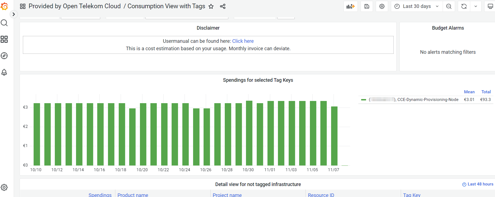
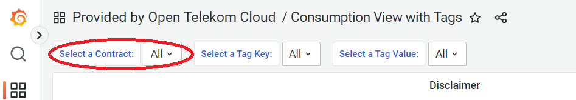

How to 
======

Switch Organizations
--------------------

You can switch your organizations by navigating to the bottom left of
your screen. If you’re allowed to see more than one organization, you
will see your currently selected organization at the top. After
clicking the “Switch” Button a new pop-up menu will appear, where you
can select another organization/tenant.

.. image:: ./media/image05.png
   :width: 4.30881in
   :height: 2.29167in

This functionality is available for each user with more than one
organization assigned to them.

Access Dashboards
-----------------

Make sure that the right organization is selected. You need to select
the global dashboard to have an overview of multiple tenants or a
tenant-specific dashboard if you want to have the data of one specific
tenant.

-  The name of a payer organization follows this pattern "ORG-Uxxxxxxxxx_Rxxxxxxxxx"

-  The name of a tenant organization follows this pattern "ORG- Uxxxxxxxxx_Rxxxxxxxxx_1000xxxxx"

You can access the dashboards of your organization by clicking Manage
within the “Square”-Symbol in the navigation bar on the left side of
the screen.

.. image:: ./media/image06.png
   :width: 1.82917in
   :height: 2.85407in

“Getting started”-Dashboard
~~~~~~~~~~~~~~~~~~~~~~~~~~~

Each organization includes a so-called “Getting Started” dashboard,
which contains some information relevant to new users of Enterprise
Dashboard. For example, all of your dashboards are listed, new
releases from Open Telekom Cloud are visible and some basic user
permissions are explained.

Provided by Open Telekom Cloud 
~~~~~~~~~~~~~~~~~~~~~~~~~~~~~~

There are two default financial dashboards within each
organization. Financial dashboards provided by Open Telekom Cloud are
located in the folder “Provided by Open Telekom Cloud” and are tagged
individually for a quick overview on which aspect a dashboard is
focused on.

.. image:: ./media/image07.png
   :width: 6.56556in
   :height: 3.08542in

Tenant consumption view
~~~~~~~~~~~~~~~~~~~~~~~

The Dashboard “Tenant consumption view” aims to display your spendings
according to your monthly invoice. It focuses on attributes, which are
visible on the pdf file of your invoice, e.g. spendings of individual
product categories and products.

.. image:: ./media/image08.png
   :width: 6.62212in
   :height: 3.24722in

You will see your aggregated costs already in the first panels of the
dashboards and will get more detailed views for individual product
categories or projects further below.

Tenant consumption view with Tags
~~~~~~~~~~~~~~~~~~~~~~~~~~~~~~~~~

The Dashboard “Tenant consumption view with Tags” displays your
invoice data with a focus on those resources, which have been
tagged. `Tag Management Service
<https://docs.otc.t-systems.com/en-us/tms/index.html>`__ is an
Openstack Service that allows the user to add up to 20 additional
metadata tags to a virtual machine or data disk (and several other
resources). The cost of these machines is visible in the CSV file of
your invoice.

You can select either specific Tag Key and Value combinations or
display all of them.

For example, you can select the Tag Key
“CCE-Dynamic-Provisioning-Node” to see your Container Costs within
Open Telekom Cloud. Elastic Cloud Servers spawned within a Cloud
Container Engine Node have this Key-Value Pair attached to it.

According to your selection, the dashboard panels will display the
costs accordingly.

.. image:: ./media/image10.png
   :width: 6.77083in
   :height: 1.79112in

More detailed views for each selected Tag Key-Value combinations can
be found further below in the dashboard.

Global consumption view
~~~~~~~~~~~~~~~~~~~~~~~

Global Dashboards are available for users of Enterprise Dashboard
Large or Extra Large.

The dashboard “Global consumption view” is built up in the same way as
the dashboard “Tenant consumption view” described in chapter 3.2.3
before. However, there is one exception. You can select either a
single, multiple, or all tenants with a selection box in the first row
of the dashboard. If you select just one tenant you will have the same
view as the tenant organization with its tenant consumption view. If
you select more than one tenant, each widget will include the costs of
the selected Tenants. In the following you will see a screenshot of
the mentioned selection box:

Global consumption view with Tags
~~~~~~~~~~~~~~~~~~~~~~~~~~~~~~~~~

Global Dashboards are available for users of Enterprise Dashboard
Large or Extra Large.

The dashboard “Global consumption view with tags” is built up in the
same way as the dashboard “Tenant consumption view with tags”. Similar
to the other global dashboard before, you can select single, multiple,
or all tenants here as well. The spendings for the tagged
infrastructure of the selected tenants will be shown.

For example, this allows you to observe the spendings of Cloud
Container Engine, already mentioned in Chapter 3.2.4, but across all
your tenants, see screenshot below:

Set up Alerts
-------------

Grafana provides built-in alerting functionalities. Please note that
alerts on OTC provided Dashboard are deleted once the dashboard gets
an update. We recommend creating copies of the widgets you want to
monitor in a new dashboard and/or folder.

In the following, you will find a short introduction, how you can set
up an alert on your dashboard. Please note that this functionality is
only available for Editor or Admin Users. The complete description can
be found here: https://grafana.com/docs/alerting/rules/

1. Identify a widget, which shows the metric you want to monitor

2. Enter the widget editor by clicking “Edit”. Click on the name of a
   widget to toggle the menu shown in the following screenshot.

.. image:: ./media/image14.png
   :width: 4.32292in
   :height: 2.17043in

3. You will be forwarded to the Edit dialogue of the widget. Click
   “Alert” and “Create Alert” to set up a new alert.

.. image:: ./media/image15.png
   :width: 5.89583in
   :height: 3.6636in

4. Define conditions for your alert. The following variables are
   important during the creation of an alert:

   a. Select a function to reduce the response of the query defined in
      2 to one values. This value will be used to compare it with the
      value defined in 3

   b. Select a query and define the relative timeframe you want to
      monitor. “query(A,720h,now-24h)” means that the results of query
      A in the last 30 days (720h) up to yesterday (now-24h) are
      monitored.

   c. Define a statement to compare with. The alarm gets fired if the
      average (see a) of the defined query (see b) is above 350

5. Select a notification channel that will be used to get notified if
   the alarm is fired.

You can create alarms and notification channels as Editor or Admin of
an organization. Ask your organization administrator for permission if
you want to use this.

Database table structure
------------------------

Enterprise Dashboard uses a PostgreSQL 10 database which has certain
tables to use.

The tables are described in the following. Based on those tables you
can create your own widgets and queries. The creation of new widgets
and dashboards is available for Editor or Admin Users of an
organization.

Business.consumption
~~~~~~~~~~~~~~~~~~~~

This table represents your billing data according to your Open Telekom
Cloud invoice (except limitations listed in chapter Current
Limitations):

+---------------------------------------+--------------------------------------+--------------------------------------+
| Field name                            | Data type                            | Description                          |
+=======================================+======================================+======================================+
| contract                              | Int8                                 | This field displays your tenant id,  |
|                                       |                                      | which is the same as your contract   |
|                                       |                                      | id                                   |
+---------------------------------------+--------------------------------------+--------------------------------------+
| business_partner_id                   | Int8                                 | This field displays your business    |
|                                       |                                      | partner id                           |
+---------------------------------------+--------------------------------------+--------------------------------------+
| organization_name                     | varchar                              | This field displays the name of your |
|                                       |                                      | company                              |
+---------------------------------------+--------------------------------------+--------------------------------------+
| regulator_id                          | Int8                                 | This field displays the payer id     |
+---------------------------------------+--------------------------------------+--------------------------------------+
| regulator_name                        | varchar                              | This field displays the name of your |
|                                       |                                      | payer                                |
+---------------------------------------+--------------------------------------+--------------------------------------+
| fte_reseller_id                       | Int4                                 | This field displays your reseller    |
|                                       |                                      | id. The reseller id is used in       |
|                                       |                                      | certain organization models, you     |
|                                       |                                      | will not need this in most cases     |
+---------------------------------------+--------------------------------------+--------------------------------------+
| agp_id                                | Int8                                 | This field displays is your overall  |
|                                       |                                      | business partner id                  |
+---------------------------------------+--------------------------------------+--------------------------------------+
| agp_name                              | varchar                              | This field displays the name of your |
|                                       |                                      | overall business partner             |
+---------------------------------------+--------------------------------------+--------------------------------------+
| quantity_unit                         | varchar                              | This field displays the unit for the |
|                                       |                                      | billing items. For example hours for |
|                                       |                                      | virtual machines or GB for volumes   |
+---------------------------------------+--------------------------------------+--------------------------------------+
| consumption_date                      | timestamp                            | This field displays when the billing |
|                                       |                                      | item was created, therefor when you  |
|                                       |                                      | consumed the service                 |
+---------------------------------------+--------------------------------------+--------------------------------------+
| unit_price                            | Float8                               | This field displays the price per    |
|                                       |                                      | quantity                             |
+---------------------------------------+--------------------------------------+--------------------------------------+
| quantity                              | Float8                               | This field displays the quantity of  |
|                                       |                                      | the data set. For example, in        |
|                                       |                                      | combination with the unit field, it  |
|                                       |                                      | would be “10 GB”                     |
+---------------------------------------+--------------------------------------+--------------------------------------+
| amount                                | Float8                               | This field displays the actual costs |
|                                       |                                      | in Euro, same as Price*Quantity.     |
|                                       |                                      | **Including** discounts and vouchers |
+---------------------------------------+--------------------------------------+--------------------------------------+
| amount_excluding_discount             | Float8                               | This field displays the actual costs |
|                                       |                                      | in Euro, same as Price*Quantity.     |
|                                       |                                      | **Without** discounts and vouchers   |
+---------------------------------------+--------------------------------------+--------------------------------------+
| product                               | varchar                              | This field displays the produt_id    |
|                                       |                                      | used in the T-Systems billing system |
+---------------------------------------+--------------------------------------+--------------------------------------+
| product_description                   | varchar                              | This field displays the name of the  |
|                                       |                                      | product                              |
+---------------------------------------+--------------------------------------+--------------------------------------+
| project_id                            | varchar                              | This field displays the project id,  |
|                                       |                                      | where the service is consumed        |
+---------------------------------------+--------------------------------------+--------------------------------------+
| project_name                          | varchar                              | This field displays the project      |
|                                       |                                      | name, where the service is consumed  |
+---------------------------------------+--------------------------------------+--------------------------------------+
| resource_id                           | varchar                              | This field displays the resource id  |
|                                       |                                      | of the service                       |
+---------------------------------------+--------------------------------------+--------------------------------------+
| billing_status                        | Int8                                 | This field displays if the data set  |
|                                       |                                      | is invoiced or not. 0 means not      |
|                                       |                                      | invoiced, 10 means invoiced          |
+---------------------------------------+--------------------------------------+--------------------------------------+
| consumption_type                      | varchar                              | This field displays the type of      |
|                                       |                                      | dataset. This can be:                |
|                                       |                                      |                                      |
|                                       |                                      | Cost types:                          |
|                                       |                                      |                                      |
|                                       |                                      | -  K017 & K018 elastic prices        |
|                                       |                                      |                                      |
|                                       |                                      | -  D102 advance payments             |
|                                       |                                      |                                      |
|                                       |                                      | -  D103& D536 monthly payments       |
|                                       |                                      |                                      |
|                                       |                                      | -  D104 allowances                   |
|                                       |                                      |                                      |
|                                       |                                      | -  D537 free amount of a monthly     |
|                                       |                                      |    payment e.g. of a Reserved        |
|                                       |                                      |    Package                           |
|                                       |                                      |                                      |
|                                       |                                      | Discount types:                      |
|                                       |                                      |                                      |
|                                       |                                      | -  R100 applied discount             |
|                                       |                                      |                                      |
|                                       |                                      | -  R400 enterprise discount          |
+---------------------------------------+--------------------------------------+--------------------------------------+
| contract_name                         | varchar                              | This field displays the name of your |
|                                       |                                      | tenant/company. This name can be     |
|                                       |                                      | additionally configured within FTE.  |
|                                       |                                      | Please get in contact with the       |
|                                       |                                      | dashboard squad for this.            |
+---------------------------------------+--------------------------------------+--------------------------------------+
| hash32                                | varchar                              | Unique identifier for a row          |
+---------------------------------------+--------------------------------------+--------------------------------------+
| region                                | varchar                              | Indicates the name of the region to  |
|                                       |                                      | which a resource belongs, e.g. eu-de |
+---------------------------------------+--------------------------------------+--------------------------------------+
| hash_key                              | varchar                              | Key for internal purposes            |
+---------------------------------------+--------------------------------------+--------------------------------------+
| sales_chanel                          | varchar                              | original column not existing, we     |
|                                       |                                      | calculate it with FTE data           |
+---------------------------------------+--------------------------------------+--------------------------------------+
| fte_ea_name                           | varchar                              | original column not existing, we     |
|                                       |                                      | calculate it with FTE data           |
+---------------------------------------+--------------------------------------+--------------------------------------+
| fte_tenant_contract                   | varchar                              | original column not existing, we     |
|                                       |                                      | calculate it with FTE data           |
+---------------------------------------+--------------------------------------+--------------------------------------+

Business.business_partner
~~~~~~~~~~~~~~~~~~~~~~~~~

+---------------------------------------+--------------------------------------+--------------------------------------+
| Field name                            | Data type                            | Description                          |
+=======================================+======================================+======================================+
| business_partner_id                   | numeric                              | This field displays your business    |
|                                       |                                      | partner id                           |
+---------------------------------------+--------------------------------------+--------------------------------------+
| business_partner_name                 | varchar                              | This field displays your business    |
|                                       |                                      | partner name                         |
+---------------------------------------+--------------------------------------+--------------------------------------+
| valid_from                            | timestamp                            | This field displays the date from    |
|                                       |                                      | which the data set is valid          |
+---------------------------------------+--------------------------------------+--------------------------------------+
| valid_to                              | timestamp                            | This field displays the date to      |
|                                       |                                      | which the data set is valid          |
+---------------------------------------+--------------------------------------+--------------------------------------+

Business.agp
~~~~~~~~~~~~

+---------------------------------------+--------------------------------------+--------------------------------------+
| Field name                            | Data type                            | Description                          |
+=======================================+======================================+======================================+
| contract                              | numeric                              | This field displays your tenant id,  |
|                                       |                                      | which is the same as your contract   |
|                                       |                                      | id                                   |
+---------------------------------------+--------------------------------------+--------------------------------------+
| agp_id                                | varchar                              | This field displays is your overall  |
|                                       |                                      | business partner id                  |
+---------------------------------------+--------------------------------------+--------------------------------------+
| agp_name                              | varchar                              | This field displays the name of your |
|                                       |                                      | overall business partner             |
+---------------------------------------+--------------------------------------+--------------------------------------+
| valid_from                            | timestamp                            | This field displays the date from    |
|                                       |                                      | which the data set is valid          |
+---------------------------------------+--------------------------------------+--------------------------------------+
| valid_to                              | timestamp                            | This field displays the date to      |
|                                       |                                      | which the data set is valid          |
+---------------------------------------+--------------------------------------+--------------------------------------+

Business.product
~~~~~~~~~~~~~~~~

+---------------------------------------+--------------------------------------+--------------------------------------+
| Field name                            | Data type                            | Description                          |
+=======================================+======================================+======================================+
| product                               | varchar                              | This field displays the produt_id    |
|                                       |                                      | used in the T-Systems billing system |
+---------------------------------------+--------------------------------------+--------------------------------------+
| product_description                   | varchar                              | This field displays the name of your |
|                                       |                                      | product                              |
+---------------------------------------+--------------------------------------+--------------------------------------+
| product_category                      | String                               | This field displays the product      |
|                                       |                                      | category of service, used in the     |
|                                       |                                      | T-Systems billing system.            |
|                                       |                                      |                                      |
|                                       |                                      | There are the following categories:  |
|                                       |                                      |                                      |
|                                       |                                      | -  Compute                           |
|                                       |                                      |                                      |
|                                       |                                      | -  Storage                           |
|                                       |                                      |                                      |
|                                       |                                      | -  Network                           |
|                                       |                                      |                                      |
|                                       |                                      | -  Management                        |
|                                       |                                      |                                      |
|                                       |                                      | -  SaaS                              |
|                                       |                                      |                                      |
|                                       |                                      | -  PaaS                              |
|                                       |                                      |                                      |
|                                       |                                      | Service                              |
+---------------------------------------+--------------------------------------+--------------------------------------+
| producty_family                       | String                               | This field displays the product      |
|                                       |                                      | family of a service                  |
+---------------------------------------+--------------------------------------+--------------------------------------+
| valid_from                            | timestamp                            | This field displays the date from    |
|                                       |                                      | which the data set is valid          |
+---------------------------------------+--------------------------------------+--------------------------------------+
| valid_to                              | timestamp                            | This field displays the date to      |
|                                       |                                      | which the data set is valid          |
+---------------------------------------+--------------------------------------+--------------------------------------+

Business.regulator
~~~~~~~~~~~~~~~~~~

+---------------------------------------+--------------------------------------+--------------------------------------+
| Field name                            | Data type                            | Description                          |
+=======================================+======================================+======================================+
| regulator_id                          | numeric                              | This field displays the payer id     |
+---------------------------------------+--------------------------------------+--------------------------------------+
| regulator_name                        | varchar                              | This field displays the name of your |
|                                       |                                      | payer                                |
+---------------------------------------+--------------------------------------+--------------------------------------+
| valid_from                            | timestamp                            | This field displays the date from    |
|                                       |                                      | which the data set is valid          |
+---------------------------------------+--------------------------------------+--------------------------------------+
| valid_to                              | timestamp                            | This field displays the date to      |
|                                       |                                      | which the data set is valid          |
+---------------------------------------+--------------------------------------+--------------------------------------+

Business.tag
~~~~~~~~~~~~

This table gives you a list of tag keys and tag values, which are
pairs. This table is used in Tagging dashboards to access dashboards
fast. The initial load is slow depending on the amount of data it
needs to query to fill these variables.

+---------------------------------------+--------------------------------------+--------------------------------------+
| Field name                            | Data type                            | Description                          |
+=======================================+======================================+======================================+
| contract                              | numeric                              | This field displays your tenant id,  |
|                                       |                                      | which is the same as your contract   |
|                                       |                                      | id                                   |
+---------------------------------------+--------------------------------------+--------------------------------------+
| reseller_id                           | numeric                              | This field displays your reseller    |
|                                       |                                      | id. The reseller id is used in       |
|                                       |                                      | certain organization models, you     |
|                                       |                                      | will not need this in most cases     |
+---------------------------------------+--------------------------------------+--------------------------------------+
| hash32                                | varchar                              | Key for internal purposes            |
+---------------------------------------+--------------------------------------+--------------------------------------+
| tag_key                               | varchar                              | This field displays the tag keys     |
|                                       |                                      | which are used in your               |
|                                       |                                      | infrastructure                       |
+---------------------------------------+--------------------------------------+--------------------------------------+
| tag_value                             | varchar                              | This field displays the tag values   |
|                                       |                                      | which are used in your               |
|                                       |                                      | infrastructure                       |
+---------------------------------------+--------------------------------------+--------------------------------------+
| valid_from                            | timestamp                            | This field displays the date from    |
|                                       |                                      | which the data set is valid          |
+---------------------------------------+--------------------------------------+--------------------------------------+
| valid_to                              | timestamp                            | This field displays the date to      |
|                                       |                                      | which the data set is valid          |
+---------------------------------------+--------------------------------------+--------------------------------------+

Business.contract
~~~~~~~~~~~~~~~~~

This table gives you a list of tenants' ids (contracts) for your
payer/reseller account ID. This table is used in Payer/Reseller
dashboards to access dashboards fast. The initial load is slow
depending on the amount of data it needs to query to fill this
variable. Searching for all distinct tenant IDs in
business.consumption has the same result as Business.contract, but the
query itself will be resolved much quicker due to smaller datasets.

+---------------------------------------+--------------------------------------+--------------------------------------+
| Field name                            | Data type                            | Description                          |
+=======================================+======================================+======================================+
| regulator                             | Int8                                 | This field displays the payer id     |
+---------------------------------------+--------------------------------------+--------------------------------------+
| reseller_id                           | Int8                                 | This field displays your reseller    |
|                                       |                                      | id. The reseller id is in most cases |
|                                       |                                      | the same as your payer id, presented |
|                                       |                                      | by the field “regulierer_id” in      |
|                                       |                                      | business.sap tables                  |
+---------------------------------------+--------------------------------------+--------------------------------------+
| contract                              | Int8                                 | This field displays your tenant id,  |
|                                       |                                      | which is the same as your contract   |
|                                       |                                      | id                                   |
+---------------------------------------+--------------------------------------+--------------------------------------+
| contract_name                         | Varchar                              | This field displays the name of your |
|                                       |                                      | tenant/company. This name can be     |
|                                       |                                      | additionally configured within FTE.  |
|                                       |                                      | Please get in contact with the       |
|                                       |                                      | dashboard squad for this.            |
+---------------------------------------+--------------------------------------+--------------------------------------+
| charging_type                         | Int8                                 |                                      |
+---------------------------------------+--------------------------------------+--------------------------------------+
| provisioning_status                   | Boolean                              | This field displays the provisioning |
|                                       |                                      | status of your tenant in Enterprise  |
|                                       |                                      | Dashboard. Should be always true     |
+---------------------------------------+--------------------------------------+--------------------------------------+

Business. dim_ol_project_names
~~~~~~~~~~~~~~~~~~~~~~~~~~~~~~

This table gives you a list of all project_ids and project_names of
your organization.

+--------------------------------------+--------------------------------------+---------------------------------------+
| Field name                           | Data type                            | Description                           |
+======================================+======================================+=======================================+
| name                                 | varchar                              | This field displays the name of your  |
|                                      |                                      | project. It’s possible to add or edit |
|                                      |                                      | projects within IAM.                  |
+--------------------------------------+--------------------------------------+---------------------------------------+
| id                                   | varchar                              | This field displays the project_id    |
|                                      |                                      | and can be used as a link between     |
|                                      |                                      | this table and business.sap           |
+--------------------------------------+--------------------------------------+---------------------------------------+
| description                          | varchar                              | This field displays the description   |
|                                      |                                      | of each project. It’s possible to add |
|                                      |                                      | a description to a project within     |
|                                      |                                      | IAM.                                  |
+--------------------------------------+--------------------------------------+---------------------------------------+

Object Storage is displayed as “MOS”. Object Storage is a global
service and has a unique ID, which can not be found within IAM. This
project_id has the project_name “MOS”.

Business.consumption_types
~~~~~~~~~~~~~~~~~~~~~~~~~~

+--------------------------------------+--------------------------------------+---------------------------------------+
| Field name                           | Data type                            | Description                           |
+======================================+======================================+=======================================+
| value_type                           | varchar                              | This field displays the type of       |
|                                      |                                      | dataset. This can be:                 |
|                                      |                                      |                                       |
|                                      |                                      | Cost types:                           |
|                                      |                                      |                                       |
|                                      |                                      | -  K017 & K018 elastic prices         |
|                                      |                                      |                                       |
|                                      |                                      | -  D102 advance payments              |
|                                      |                                      |                                       |
|                                      |                                      | -  D536 monthly payments              |
|                                      |                                      |                                       |
|                                      |                                      | -  D104 allowances                    |
|                                      |                                      |                                       |
|                                      |                                      | Discount types:                       |
|                                      |                                      |                                       |
|                                      |                                      | -  R100 applied discount              |
|                                      |                                      |                                       |
|                                      |                                      | R400 enterprise discount              |
+--------------------------------------+--------------------------------------+---------------------------------------+
| consumption_types_description        | varchar                              | | Description of value type.          |
|                                      |                                      | | e.g.                                |
|                                      |                                      | | value type = K014                   |
|                                      |                                      |                                       |
|                                      |                                      | Consumption_type_description = Usage  |
|                                      |                                      | for PLM Cloud with price              |
+--------------------------------------+--------------------------------------+---------------------------------------+

Business.dim_ol_capacity_ecs_compute
~~~~~~~~~~~~~~~~~~~~~~~~~~~~~~~~~~~~

This table is only available if you use Enterprise Dashboard Extra
Large. It’s possible to receive Capacity data of your Open Telekom
Cloud Hybrid in Enterprise Dashboard. The actual availability of data
sets depends on your Hybrid Installation. Data is exported once per
day. The “timestamp” attribute shows when the data was collected.

+--------------------------------------+--------------------------------------+---------------------------------------+
| Field name                           | Data type                            | Description                           |
+======================================+======================================+=======================================+
| service                              | varchar                              | Indicates the service name, which     |
|                                      |                                      | identifies the service to which a     |
|                                      |                                      | resource belongs                      |
+--------------------------------------+--------------------------------------+---------------------------------------+
| timestamp                            | timestamp                            | Indicates the time stamp in Unix      |
|                                      |                                      | format, e.g. 1598306400000            |
+--------------------------------------+--------------------------------------+---------------------------------------+
| region                               | varchar                              | Indicates the name of the region to   |
|                                      |                                      | which a resource belongs, e.g. eu-de  |
+--------------------------------------+--------------------------------------+---------------------------------------+
| az                                   | varchar                              | Indicates the name of the AZ to which |
|                                      |                                      | a resource belongs, e.g. eu-de-01     |
+--------------------------------------+--------------------------------------+---------------------------------------+
| zone                                 | varchar                              | Indicates the POD to which a resource |
|                                      |                                      | belongs                               |
+--------------------------------------+--------------------------------------+---------------------------------------+
| cluster                              | varchar                              | Indicates the cluster to which a      |
|                                      |                                      | resource belongs.                     |
+--------------------------------------+--------------------------------------+---------------------------------------+
| host                                 | varchar                              | None                                  |
+--------------------------------------+--------------------------------------+---------------------------------------+
| resource_type                        | varchar                              | Indicates the resource type, e.g. s2  |
+--------------------------------------+--------------------------------------+---------------------------------------+
| type                                 | varchar                              | Indicates the data type. ECS resource |
|                                      |                                      | data types are as follows:            |
|                                      |                                      |                                       |
|                                      |                                      | vCpu, memory, vGpu, and vmTotal       |
+--------------------------------------+--------------------------------------+---------------------------------------+
| total                                | float8                               | Indicates the total number of         |
|                                      |                                      | resources (vCPU: number; Memory: TB;  |
|                                      |                                      | vGPU: number).                        |
+--------------------------------------+--------------------------------------+---------------------------------------+
| used                                 | float8                               | Indicates the number of the used      |
|                                      |                                      | resources (vCPU: number; Memory: TB;  |
|                                      |                                      | vGPU: number).                        |
+--------------------------------------+--------------------------------------+---------------------------------------+
| free                                 | float8                               | Indicates the number of the remaining |
|                                      |                                      | resources (vCPU: number; Memory: TB;  |
|                                      |                                      | vGPU: number).                        |
+--------------------------------------+--------------------------------------+---------------------------------------+
| allocated                            | float8                               | Indicates the number of the allocated |
|                                      |                                      | resources (vCPU: number; Memory: TB;  |
|                                      |                                      | vGPU: number).                        |
+--------------------------------------+--------------------------------------+---------------------------------------+
| spot_allocated                       | float8                               | None                                  |
+--------------------------------------+--------------------------------------+---------------------------------------+
| containerAllocated                   | float8                               | None                                  |
+--------------------------------------+--------------------------------------+---------------------------------------+
| available                            | float8                               | Indicates the number of the available |
|                                      |                                      | resources (vCPU: number; Memory: TB;  |
|                                      |                                      | vGPU: number).                        |
+--------------------------------------+--------------------------------------+---------------------------------------+
| used_ratio                           | float8                               | Indicates the resource usage.         |
+--------------------------------------+--------------------------------------+---------------------------------------+
| allocated_ratio                      | float8                               | Indicates the resource allocation     |
|                                      |                                      | rate.                                 |
+--------------------------------------+--------------------------------------+---------------------------------------+
| over_subscription_ratio              | float8                               | None                                  |
+--------------------------------------+--------------------------------------+---------------------------------------+
| additional_info                      | varchar                              | None                                  |
+--------------------------------------+--------------------------------------+---------------------------------------+
| region_id                            | varchar                              | Indicates the region ID to which a    |
|                                      |                                      | resource belongs.                     |
+--------------------------------------+--------------------------------------+---------------------------------------+
| az_id                                | varchar                              | Indicates the ID of the AZ to which a |
|                                      |                                      | resource belongs                      |
+--------------------------------------+--------------------------------------+---------------------------------------+
| zone_type                            | varchar                              | Indicates the resource type to which  |
|                                      |                                      | a resource belongs                    |
+--------------------------------------+--------------------------------------+---------------------------------------+
| Host_group                           | varchar                              | None                                  |
+--------------------------------------+--------------------------------------+---------------------------------------+
| host_total                           | int4                                 | Number of resources in total          |
+--------------------------------------+--------------------------------------+---------------------------------------+
| etl_created                          | timestamp                            | Displays when this data set was       |
|                                      |                                      | created                               |
+--------------------------------------+--------------------------------------+---------------------------------------+

Business.dim_ol_capacity_ecs_vm
~~~~~~~~~~~~~~~~~~~~~~~~~~~~~~~

This table is only available if you use Enterprise Dashboard Extra
Large. It’s possible to receive Capacity data of your Open Telekom
Cloud Hybrid in Enterprise Dashboard. The actual availability of data
sets depends on your Hybrid Installation. Data is exported once per
day. The “timestamp” attribute shows when the data was collected.

+--------------------------------------+--------------------------------------+---------------------------------------+
| Field name                           | Data type                            | Description                           |
+======================================+======================================+=======================================+
| service                              | varchar                              | Indicates the service name, which     |
|                                      |                                      | identifies the service to which a     |
|                                      |                                      | resource belongs                      |
+--------------------------------------+--------------------------------------+---------------------------------------+
| timestamp                            | timestamp                            | Indicates the time stamp in Unix      |
|                                      |                                      | format, e.g. 1598306400000            |
+--------------------------------------+--------------------------------------+---------------------------------------+
| region                               | varchar                              | Indicates the name of the region to   |
|                                      |                                      | which a resource belongs.             |
+--------------------------------------+--------------------------------------+---------------------------------------+
| az                                   | varchar                              | Indicates the name of the AZ to which |
|                                      |                                      | a resource belongs.                   |
+--------------------------------------+--------------------------------------+---------------------------------------+
| zone                                 | varchar                              | Indicates the POD to which a resource |
|                                      |                                      | belongs.                              |
+--------------------------------------+--------------------------------------+---------------------------------------+
| cluster                              | varchar                              | Indicates the name of the cluster to  |
|                                      |                                      | which a resource belongs.             |
+--------------------------------------+--------------------------------------+---------------------------------------+
| host                                 | varchar                              | None                                  |
+--------------------------------------+--------------------------------------+---------------------------------------+
| resource_type                        | varchar                              | Indicates the resource type, e.g.     |
|                                      |                                      | s2.8xlarge.2                          |
+--------------------------------------+--------------------------------------+---------------------------------------+
| type                                 | varchar                              | None                                  |
+--------------------------------------+--------------------------------------+---------------------------------------+
| total                                | float8                               | None                                  |
+--------------------------------------+--------------------------------------+---------------------------------------+
| used                                 | float8                               | None                                  |
+--------------------------------------+--------------------------------------+---------------------------------------+
| free                                 | float8                               | None                                  |
+--------------------------------------+--------------------------------------+---------------------------------------+
| allocated                            | float8                               | Indicates the number of allocated     |
|                                      |                                      | resources. Unit: VM.                  |
+--------------------------------------+--------------------------------------+---------------------------------------+
| spot_allocated                       | float8                               | None                                  |
+--------------------------------------+--------------------------------------+---------------------------------------+
| containerAllocated                   | float8                               | None                                  |
+--------------------------------------+--------------------------------------+---------------------------------------+
| available                            | float8                               | None                                  |
+--------------------------------------+--------------------------------------+---------------------------------------+
| used_ratio                           | float8                               | None                                  |
+--------------------------------------+--------------------------------------+---------------------------------------+
| allocated_ratio                      | float8                               | None                                  |
+--------------------------------------+--------------------------------------+---------------------------------------+
| over_subscription_ratio              | float8                               | None                                  |
+--------------------------------------+--------------------------------------+---------------------------------------+
| additional_info                      | varchar                              | None                                  |
+--------------------------------------+--------------------------------------+---------------------------------------+
| flavor_vCpu                          | float8                               | Indicates the number of vCpu          |
+--------------------------------------+--------------------------------------+---------------------------------------+
| flavor_mem                           | float8                               | Indicates the amount of memory in GB  |
+--------------------------------------+--------------------------------------+---------------------------------------+
| is_public                            | varchar                              | None                                  |
+--------------------------------------+--------------------------------------+---------------------------------------+
| region_id                            | varchar                              | Indicates the region ID to which a    |
|                                      |                                      | resource belongs.                     |
+--------------------------------------+--------------------------------------+---------------------------------------+
| az_id                                | varchar                              | Indicates the ID of the AZ to which a |
|                                      |                                      | resource belongs                      |
+--------------------------------------+--------------------------------------+---------------------------------------+
| zone_type                            | varchar                              | None                                  |
+--------------------------------------+--------------------------------------+---------------------------------------+
| host_total                           | int4                                 | None                                  |
+--------------------------------------+--------------------------------------+---------------------------------------+
| etl_created                          | timestamp                            | Displays when this data set was       |
|                                      |                                      | created                               |
+--------------------------------------+--------------------------------------+---------------------------------------+

Business. dim_ol_capacity_evs_capacity
~~~~~~~~~~~~~~~~~~~~~~~~~~~~~~~~~~~~~~

This table is only available if you use Enterprise Dashboard Extra
Large. It’s possible to receive Capacity data of your Open Telekom
Cloud Hybrid in Enterprise Dashboard. The actual availability of data
sets depends on your Hybrid Installation. Data is exported once per
day. The “timestamp” attribute shows when the data was collected.

+--------------------------------------+--------------------------------------+---------------------------------------+
| Field name                           | Data type                            | Description                           |
+======================================+======================================+=======================================+
| service                              | varchar                              | Indicates the service name, which     |
|                                      |                                      | identifies the service to which a     |
|                                      |                                      | resource belongs                      |
+--------------------------------------+--------------------------------------+---------------------------------------+
| timestamp                            | timestamp                            | Indicates the time stamp in Unix      |
|                                      |                                      | format, e.g. 1598306400000            |
+--------------------------------------+--------------------------------------+---------------------------------------+
| region                               | varchar                              | Indicates the name of the region to   |
|                                      |                                      | which a resource belongs.             |
+--------------------------------------+--------------------------------------+---------------------------------------+
| az                                   | varchar                              | Indicates the name of the AZ to which |
|                                      |                                      | a resource belongs.                   |
+--------------------------------------+--------------------------------------+---------------------------------------+
| zone                                 | varchar                              | Indicates the POD to which a resource |
|                                      |                                      | belongs.                              |
+--------------------------------------+--------------------------------------+---------------------------------------+
| cluster                              | varchar                              | Indicates the storage pool to which   |
|                                      |                                      | the resource belongs                  |
+--------------------------------------+--------------------------------------+---------------------------------------+
| host                                 | varchar                              | None                                  |
+--------------------------------------+--------------------------------------+---------------------------------------+
| resource_type                        | varchar                              | None                                  |
+--------------------------------------+--------------------------------------+---------------------------------------+
| type                                 | varchar                              | Indicates the data type. EVS data     |
|                                      |                                      | types are as follows:                 |
|                                      |                                      |                                       |
|                                      |                                      | SATA, SAS, and SSD                    |
+--------------------------------------+--------------------------------------+---------------------------------------+
| total                                | float8                               | Indicates the total number of         |
|                                      |                                      | resources. Unit: TB.                  |
+--------------------------------------+--------------------------------------+---------------------------------------+
| used                                 | float8                               | Indicates the number of used          |
|                                      |                                      | resources. Unit: TB.                  |
+--------------------------------------+--------------------------------------+---------------------------------------+
| free                                 | float8                               | Indicates the remaining number of     |
|                                      |                                      | resources. Unit: TB.                  |
+--------------------------------------+--------------------------------------+---------------------------------------+
| allocated                            | float8                               | Indicates the allocated number of     |
|                                      |                                      | resources. Unit: TB.                  |
+--------------------------------------+--------------------------------------+---------------------------------------+
| spot_allocated                       | float8                               | None                                  |
+--------------------------------------+--------------------------------------+---------------------------------------+
| containerAllocated                   | float8                               | None                                  |
+--------------------------------------+--------------------------------------+---------------------------------------+
| available                            | float8                               | Indicates the number of available     |
|                                      |                                      | resources. Unit: TB.                  |
+--------------------------------------+--------------------------------------+---------------------------------------+
| used_ratio                           | float8                               | Indicates the resource usage          |
+--------------------------------------+--------------------------------------+---------------------------------------+
| allocated_ratio                      | float8                               | Indicates the resource allocation     |
|                                      |                                      | rate.                                 |
+--------------------------------------+--------------------------------------+---------------------------------------+
| over_subscription_ratio              | float8                               | Indicates the overcommitment ratio.   |
+--------------------------------------+--------------------------------------+---------------------------------------+
| additional_info                      | varchar                              |                                       |
+--------------------------------------+--------------------------------------+---------------------------------------+
| sata_physical_host                   | varchar                              | Indicates the number of SATA PMs.     |
|                                      |                                      | Unit: PCs                             |
+--------------------------------------+--------------------------------------+---------------------------------------+
| ssd_physical_host                    | varchar                              | Indicates the number of SSD PMs.      |
|                                      |                                      | Unit: PCs                             |
+--------------------------------------+--------------------------------------+---------------------------------------+
| sas_physical_host                    | varchar                              | Indicates the number of SAS PMs.      |
|                                      |                                      | Unit: PCs                             |
+--------------------------------------+--------------------------------------+---------------------------------------+
| pool_model                           | varchar                              | None                                  |
+--------------------------------------+--------------------------------------+---------------------------------------+
| region_id                            | varchar                              | Indicates the ID of the AZ to which a |
|                                      |                                      | resource belongs                      |
+--------------------------------------+--------------------------------------+---------------------------------------+
| zone_type                            | varchar                              | Indicates the resource type to which  |
|                                      |                                      | a resource belongs                    |
+--------------------------------------+--------------------------------------+---------------------------------------+
| etl_created                          | timestamp                            | Displays when this data set was       |
|                                      |                                      | created                               |
+--------------------------------------+--------------------------------------+---------------------------------------+

Business.dim_ol_capacity_obs
~~~~~~~~~~~~~~~~~~~~~~~~~~~~

This table is only available if you use Enterprise Dashboard Extra
Large. It’s possible to receive Capacity data of your Open Telekom
Cloud Hybrid in Enterprise Dashboard. The actual availability of data
sets depends on your Hybrid Installation. Data is exported once per
day. The “timestamp” attribute shows when the data was collected.

+--------------------------------------+--------------------------------------+---------------------------------------+
| Field name                           | Data type                            | Description                           |
+======================================+======================================+=======================================+
| service                              | varchar                              | Indicates the service name, which     |
|                                      |                                      | identifies the service to which a     |
|                                      |                                      | resource belongs                      |
+--------------------------------------+--------------------------------------+---------------------------------------+
| timestamp                            | timestamp                            | Indicates the time stamp in Unix      |
|                                      |                                      | format, e.g. 1598306400000            |
+--------------------------------------+--------------------------------------+---------------------------------------+
| region                               | varchar                              | Indicates the name of the region to   |
|                                      |                                      | which a resource belongs.             |
+--------------------------------------+--------------------------------------+---------------------------------------+
| az                                   | varchar                              | None                                  |
+--------------------------------------+--------------------------------------+---------------------------------------+
| zone                                 | varchar                              | None                                  |
+--------------------------------------+--------------------------------------+---------------------------------------+
| cluster                              | varchar                              | Indicates the cluster to which a      |
|                                      |                                      | resource belongs.                     |
+--------------------------------------+--------------------------------------+---------------------------------------+
| host                                 | varchar                              | None                                  |
+--------------------------------------+--------------------------------------+---------------------------------------+
| resource_type                        | varchar                              | None                                  |
+--------------------------------------+--------------------------------------+---------------------------------------+
| type                                 | varchar                              | None                                  |
+--------------------------------------+--------------------------------------+---------------------------------------+
| total                                | float8                               | Indicates the total number of         |
|                                      |                                      | resources. Unit: TB.                  |
+--------------------------------------+--------------------------------------+---------------------------------------+
| used                                 | float8                               | Indicates the remaining number of     |
|                                      |                                      | resources. Unit: TB.                  |
+--------------------------------------+--------------------------------------+---------------------------------------+
| free                                 | float8                               | Indicates the remaining number of     |
|                                      |                                      | resources. Unit: TB.                  |
+--------------------------------------+--------------------------------------+---------------------------------------+
| allocated                            | float8                               | None                                  |
+--------------------------------------+--------------------------------------+---------------------------------------+
| spot_allocated                       | float8                               | None                                  |
+--------------------------------------+--------------------------------------+---------------------------------------+
| containerAllocated                   | float8                               | None                                  |
+--------------------------------------+--------------------------------------+---------------------------------------+
| available                            | float8                               | None                                  |
+--------------------------------------+--------------------------------------+---------------------------------------+
| used_ratio                           | float8                               | Indicates the resource usage.         |
+--------------------------------------+--------------------------------------+---------------------------------------+
| allocated_ratio                      | float8                               | None                                  |
+--------------------------------------+--------------------------------------+---------------------------------------+
| over_subscription_ratio              | float8                               | None                                  |
+--------------------------------------+--------------------------------------+---------------------------------------+
| additional_info                      | varchar                              | None                                  |
+--------------------------------------+--------------------------------------+---------------------------------------+
| logic_total                          | varchar                              | Indicates the total logic capacity.   |
|                                      |                                      | Unit: TB.                             |
+--------------------------------------+--------------------------------------+---------------------------------------+
| logic_used                           | varchar                              | Indicates the number of used logic.   |
|                                      |                                      | Unit: TB.                             |
+--------------------------------------+--------------------------------------+---------------------------------------+
| zone_type                            | varchar                              |                                       |
+--------------------------------------+--------------------------------------+---------------------------------------+
| host_total                           | int4                                 |                                       |
+--------------------------------------+--------------------------------------+---------------------------------------+
| etl_created                          | timestamp                            | Displays when this data set was       |
|                                      |                                      | created                               |
+--------------------------------------+--------------------------------------+---------------------------------------+

