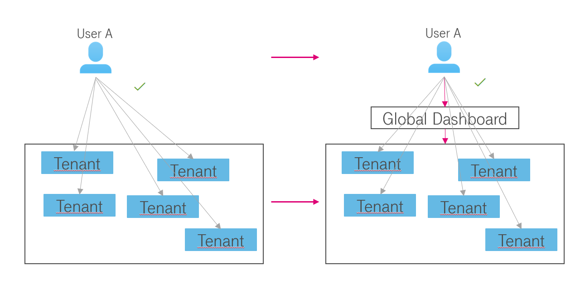
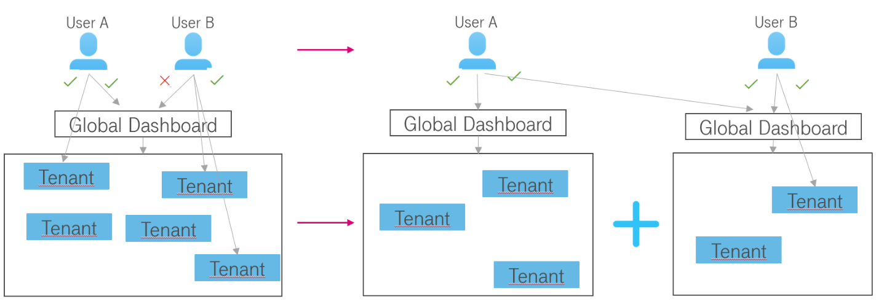

Introduction
============

Enterprise Dashboard is a web-based dashboard providing access to
billing data. It allows to check spendings for Open Telekom Cloud
infrastructure. It comes with dedicated views for specific domains and
their cost drivers.

Enterprise Dashboard can be accessed by visiting the following URL:

  https://enterprise-dashboard.otc-service.com

To enter Enterprise Dashboard you need to enter your credentials. Your
email and password are required. You will receive an invitation for
Enterprise Dashboard, once the order is confirmed and processed. With
this invitation, you can set the password of your user account.

Your email and password are case-sensitive. Please check upper and
lower cases before clicking Log In.

**Note:** Enterprise Dashboard is offered via Direct sales
only. Please contact either your contractual partner to set up your
access or contact Request-OpenTelekomCloud@telekom.de.

API
---

Most functionality of the Enterprise Dashboard is also available via
an REST HTTP endpoint for integration in other applications. Please
refer to the `Enterprise Dashboard API Reference
<https://docs.otc.t-systems.com/enterprise-dashboard/api-ref/>`__

Monitor Spendings on a Payer Level
----------------------------------

It will also allow you to monitor your spendings on a payer level.
This means that all costs for each of your tenants assigned to you as
a payer are visible within one Dashboard.

Visualization with Grafana
--------------------------

Grafana 9.0.4 is currently used to render the monitored data. Feel
free to check the documentation of Grafana as well, if you’re missing
certain functionalities within this user manual. Please check the
following link:

  https://grafana.com/docs/grafana/v9.0/

Product versions
----------------

Enterprise Dashboard is available in three versions.

+-------------------------+----------+-----------+----------+--------------+
| Product Versions        | API      | Dashboard | Multi    | Organization |
|                         | Access   | Self      | Tenant   | Management   |
|                         |          | Service   |          |              |
+=========================+==========+===========+==========+==============+
| Enterprise Dashboard    | ✓        | ✓         |          |              |
| Small                   |          |           |          |              |
+-------------------------+----------+-----------+----------+--------------+
| Enterprise Dashboard    | ✓        | ✓         |          |              |
| Medium                  |          |           |          |              |
+-------------------------+----------+-----------+----------+--------------+
| Enterprise Dashboard    | ✓        | ✓         | ✓        |              |
| Large                   |          |           |          |              |
+-------------------------+----------+-----------+----------+--------------+

The product feature **API access** gives you access to all API
calls described in chapter “API”.

The product feature **Dashboard Self Service** gives you the option to
create “Admin” or “Editor” users, which are allowed to create
dashboards, widgets, alerts, or users by themselves. Some examples are
described in the Chapter “How to”.

The product feature **Multi-Tenant** gives you access to a global
dashboard, which aggregates all spendings across several tenants. This
allows you to manage your business on a bigger scale.

In a scenario like the above, it gets very hard for User A to compare
data from multiple tenants. Each of his tenants has only access to the
data of the own tenant. To compare data he needs a global dashboard,
which allows him to access and compare data of all tenants in one
organization. Also from a financial perspective, it’s recommended to
consume Enterprise Dashboard Large instead of multiple Enterprise
Dashboard Medium.

The product feature **Organizations Management** helps you to easily
manage access to your dashboards and data. It allows you to split your
payer account (see `chapter 2.4 <#Organizations>`__) into smaller
parts with separate global dashboards. This allows you to move certain
tenants into a new completely separated organization with new users,
user groups, and dashboards.

In a scenario like above, where User B is not allowed to access
certain tenants, you can separate those tenants and give User B access
to that organization and therefore access to the global dashboard.

